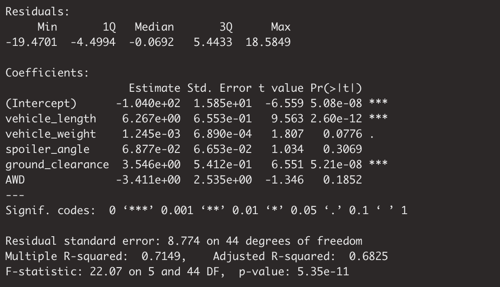
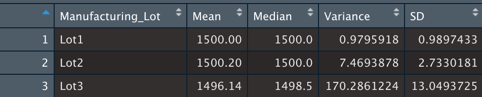
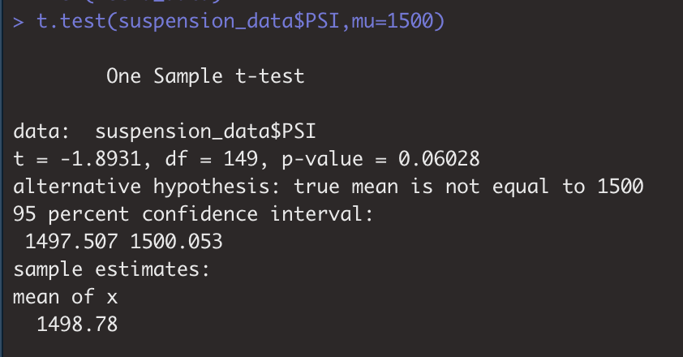
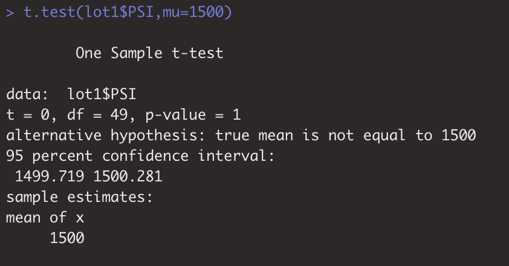
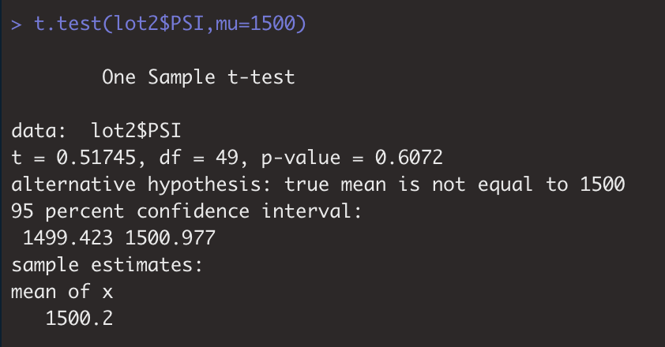
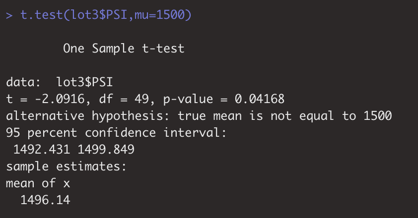

# MechaCar_Statistical_Analysis

##  Linear Regression to Predict MPG

### Purpose:

Design a linear model that predicts the mpg of MechaCar prototypes using several variables from the MechaCar_mpg.csv dataset.

### Depend and independent variables

**Dependent variables**: vehicle length, vehicle weight, spoiler angle, ground clearance, AWD.

**Independent variable**: mpg.

### Hypotheses for linear regression test:

**H0**: The slope of the linear model is zero, which means there is no significant linear relationship, each depend variable would be determined by random chance.

**Ha**: The slope of the linear model is not zero, which means there is significant linear relationship, each depend variable would affect independent variable.

**Significant level**: 0.05

### Result:

**mpg = 6.267 * vehicle length + 0.001245 * vehicle weight + 0.06877 * spoiler angle + 3.546 * ground clearance - 3.411 * AWD - 104.0**

### Summary

The following conclusions that can be summarized based on our result:

1.	According to the above table, we can conclude that vehicle length (p-value=2.60e-12) and ground clearance (p-value=5.21e-08) provided a non-random amount of variance to the mpg values base on a 0.05 significant level.

2.	The slope of the linear model considered not to be zero. Since the overall p-value of this model is 5.35e-11 < 0.05, therefore, we rejected the null hypothesis, which indicates that there is a relationship existing between dependent variables and independent variable.

3.	According to the r-squared value, we can conclude that this linear model effectively predicts mpg of MechaCar prototypes. From the table above, we found that multiple R-square = 0.7149, which means approximately 71% of the future data would fit the regression model. Therefore, this model predicts mpg effectively based on this dataset.

##  Summary Statistics on Suspension Coils

### Purpose: 

To determine if the manufacturing process is consistent across production lots based on the weight capacities of multiple suspension coils dataset.

### Required design specification for the MechaCar suspension coils:

The variance of the suspension coils must not exceed 100 pounds per square inch

### Result

-	The suspension coil’s PSI continuous variable across all manufacturing lots

-	The following PSI metrics for each lot: mean, median, variance, and standard deviation.

### Summary

According to the above results, we found that the current manufacturing data meet this design specification for all manufacturing lots in total (Variance=62.29 < 100). Looking at each manufacturing lot individually, lot 1 and 2 also meet this design specification (Variance = 0.97 and 7.47 respectively). However, lot 3 shows a variance with 170, which exceeds this design specification. Therefore, we can conclude that the manufacturing process is not consistent across production lots (lot 3 doesn’t meet design specification).

## T-Tests on Suspension Coils

### Purpose:

Perform t-tests to determine if the mean PSI across all manufacturing lots and each lot individually are statistically different from the population mean of 1,500 pounds per square inch.

### Hypotheses for one-sample t-test:

**H0**: There is no statistical difference between the observed sample mean and its presumed population mean.

**Ha**: There is a statistical difference between the observed sample mean and its presumed population mean.

**Significant level**: 0.05

### Result and Summary:

Assuming significant level= 0.05, p-value > 0.05. Therefore, we fail to reject the null hypothesis, and state that the mean PSI across all manufacturing lots are not statistically different from the population mean of 1,500 pounds per square inch.

Assuming significant level= 0.05, p-value > 0.05. Therefore, we fail to reject the null hypothesis, and state that the mean PSI of manufacturing lot1 is not statistically different from the population mean of 1,500 pounds per square inch.

Assuming significant level= 0.05, p-value > 0.05. Therefore, we fail to reject the null hypothesis, and state that the mean PSI of manufacturing lot2 is not statistically different from the population mean of 1,500 pounds per square inch.

Assuming significant level= 0.05, p-value > 0.05. Therefore, we reject the null hypothesis, and state that the mean PSI of manufacturing lot3 is statistically different from the population mean of 1,500 pounds per square inch.

According to the above results, we can conclude that the manufacturing process of lot3 is not consistent with across production lots, which is consistent with the conclusion based on the Summary Statistics.

## Study Design: MechaCar vs Competition

### Purpose:

Design a statistical study to compare performance of the MechaCar vehicles against performance of vehicles from other manufacturers.

### Metrics

**Dependent variable**: MPG, maintenance cost, safety rating, available space

**Independent variable**: yearly sells volume

### Hypothesis:

**H0**: There is no significant linear relationship between dependent variables and independent variable

**Ha**: There is a significant linear relationship between dependent variables and independent variable

### Statistical Test

A multiple linear regression test can be performed in order to determine which dependent variable has the greatest impact on its yearly sells volume, which can be used as an indicator for the performance of the vehicle.

After determining the most important factors that could impact its yearly sells volume, a t-test can then be performed to determine which factor needs to be improved in order to win the competition.

### Data

The following data for MechaCar and other manufacturers for past 10 years need to be collected:
- MPG
- maintenance cost
- safety rating
- available space
- yearly sells volume
